## 6.2 Lesson Plan - Advanced AJAX

### Overview

In this class, students will be building upon their knowledge of AJAX to retrieve data via the OMDb api and display data onto an HTML page.

##### Instructor Priorities

* Instructor should offer a thorough overview of APIs, JSONs, and AJAX using the provided slides.
* Students should complete the Weather in Bujumbura Activity
* Students should complete the Working Movie App Activity

##### Instructor Notes

* Use the slideshow as an initial starting point for your conversation on APIs. Make sure that students see the power of APIs and understand how APIs provide a link between front-end (what they've learned so far) and backend (what they will soon be learning). Be sure to replace the data and use the correct slide deck for your campus.

* Today's activities will feel pretty challenging and confusing to the majority of your students. Use your best judgement and adjust as necessary. If you need to cut the Spotify exercise by all means do so. Offer ample support and let students know that things will "click" eventually -- even if it doesn't quite click just yet.

* TAs should reference [6.2-TimeTracker](6.2-TimeTracker.xlsx) to help keep track of time during class.

- - -

### Class Objectives

* To solidify understanding of APIs, JSONs, and their roles in full-stack web development
* To increase comfort working with APIs and AJAX calls in data-rich applications  

- - -

### 1. Instructor Do: API and AJAX Slide Show (12 min)

* Begin class by welcoming students and asking if there are any lingering questions.

* Then open up the [`API_AJAX`](Slide-Shows/API_AJAX.pptx) slideshow and begin presenting the slides. Encourage students to answer questions and ask questions. Draw upon your own insight regarding APIs to try and further solidify their understanding of the role APIs play in web development. Show the videos included in the powerpoint when appropriate.

* Just be sure to keep focused and stay on track of time!

### 2. Students Do: The Weather in Bujumbura (15 min)

* Then open the file [bujumbura.html](Activities/01_Bujumbura/bujumbura-solved.html) in your Browser. Explain to them them that this application uses the [OpenWeatherMap API](http://openweathermap.org/api) to retrieve live snippets of weather information about Bujumbura (the capital of Burundi (which is a city in Africa)).

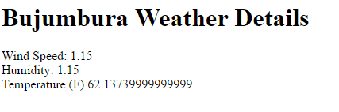

* Then slack out the following files and instructions to students.

* **Files:**

  * [`bujumbura-easier.html`](Activities/01_Bujumbura/bujumbura-easier.html)

  * [`bujumbura-harder.html`](Activities/01_Bujumbura/bujumbura-harder.html)

* **Instructions:**

  * Using either [`bujumbura-easier.html`](Activities/01_Bujumbura/bujumbura-easier.html) or [`bujumbura-harder.html`](Activities/01_Bujumbura/bujumbura-harder.html) as a starting point, add in the missing code necessary to accomplish the following:

    * Query the [OpenWeatherMap API](http://openweathermap.org/api) for the current weather data on Bujumbura, Burundi.

    * Log the retrieved data from this query to console.

    * Parse the retrieved data to display wind speed, humidity, and temperature information into the HTML.

    * HINT: You will need to request an API key from the website.

    * BONUS: Figure out how to convert the Kelvin temperature provided into Fahrenheit.

    * NOTE: Don't worry if this feels hard. Push yourself!

* **Instructor / TAs:**

  * Walk around and help students accomplish this task as necessary.

### 3. Instructor Do: Review Activity (5 min)

* Open the file [`bujumbura-solved.html`](Activities/01_Bujumbura/bujumbura-solved.html) in Sublime and walk students through the code.

* During your explanation, be sure to point out each of the following:

  * That we retrieved an API key from the [OpenWeatherMap API](http://openweathermap.org/api) site.

  * That we then used this APIKey as part of our `queryURL` along with the city parameter (in this case Bujumbura)

    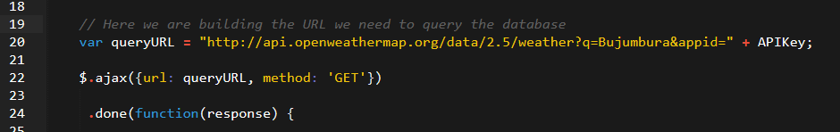

  * That we then passed this `queryURL` into our AJAX call.

  * Then inside the `.done` method of the AJAX call, we are capturing data inside of a variable called `response`.

  * And that we parse this `response` JSON to retrieve individual properties like `wind.speed`, `main.humidity`, and `main.temp`. This was then dumped using jQuery into the HTML.

  * Finally, point out that when it came to the bonus we converted the temperature value by incorporating the Kelvin data into a formulaic conversion.

    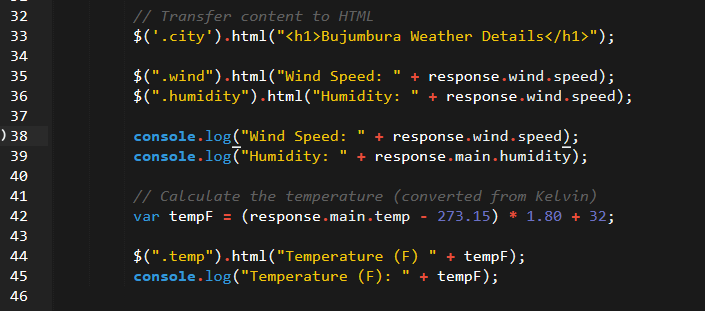

* Ask students how you would recycle the code shown to instead find the weather in `London`. (Answer: Just change the `queryURL`)

* Ask students why all of the code needed be inside the `.done` function. (Answer: Otherwise, we might not have data yet.)

* Check if there are any other questions about this application before moving on.

### 4. Instructor Do: Working Movie App Demo (5 min)

* Next open the file [`working-movie-app.html`](Activities/06-WorkingMovieApp/working-movie-app-solved.html) in your browser. Let students know that in today's class we will be working towards building this.

* In demonstrating this application:

  * Click on the existing buttons to show that movies are displayed.

  * Create a new movie to the listing, point out that a button was generated dynamically, and that this button becomes a clickable AJAX caller of its own.

### 5. Students Do: Movie App JSON Dump (10 min)

* Then open the file [`2-movie-json-dump-solution.html`](Activities/02-MovieJSONDump/2-movie-json-dump-solution.html) in your browser. Demonstrate that this application takes in a user input then uses the [OMDb API](http://www.omdbapi.com/) to retrieve movie in the form of a JSON. This movie is then appended directly into the HTML as is.

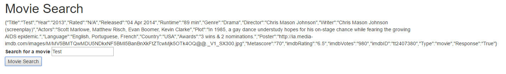

* Then slack out the following files and instructions.

* **Files:**

  * [`2-movie-json-dump.html`](Activities/02-MovieJSONDump/2-movie-json-dump.html)

* **Instructions:**

  * Using [`2-movie-json-dump.html`](Activities/02-MovieJSONDump/2-movie-json-dump.html) as starter code, add functionality such that clicking `Movie Search` triggers an AJAX call to the OMDb database and the JSON response to be appended onto the page.

  * If you finish early, begin reading about the [Spotify API](https://developer.spotify.com/). Try to understand how to search for a specific artist. Then try to understand how to search for tracks associated with that artist. As a final step, try to figure out how to get a "spotify player" to display on your webpage.

### 6. Instructor Do: Review Activity (5 min)

* Review the JSON Dump activity. In your discussion be sure to point out:

  * The standard `AJAX` syntax of capturing both `queryURL` and `GET` method.

  * Point out the use of `JSON.stringify(response)` for converting the retrieved JSON into a string that can be put placed into text.

    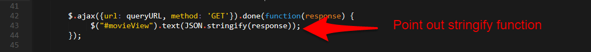

### 7. Students Do: Dynamic Movie Button Layout (25 min)

* Next demonstrate the file [`movie-button-layout-solved.html`](Activities/03-MovieButtonLayout/movie-button-layout-solved.html) in your browser. Point out that this application allows users to create new buttons dynamically when a user clicks `Add a Movie Bro`.

* Then slack out the following files and instructions.

* **Files:**

  * [`movie-button-layout-easier.html`](Activities/03-MovieButtonLayout/movie-button-layout-easier.html)
  * [`movie-button-layout-harder.html`](Activities/03-MovieButtonLayout/movie-button-layout-harder.html)

* **Instructions:**

  * Using either [`movie-button-layout-easier.html`](Activities/03-MovieButtonLayout/movie-button-layout-easier.html) or [`movie-button-layout-harder.html`](Activities/03-MovieButtonLayout/movie-button-layout-harder.html) as a starting-point, replicate the functionality of the application just demonstrated to you.

  * Your final code should:

    * Dynamically generate the initial buttons using jQuery

    * Allow users to create new buttons upon entering text in the textbox and clicking `Add a Movie Bro`.

    * If you finish early begin reading about the [Spotify API](https://developer.spotify.com/). Try to understand how to search for a specific artist. Then try to understand how to search for tracks associated with that artist. As a final step, try to figure out how to get a "spotify player" to display on your webpage.

### 8. Instructor Do: Review Activity (10 min)

* Next, review the solution provided in [`movie-button-layout-solved.html`](Activities/03-MovieButtonLayout/movie-button-layout-solved.html). In discussing the solution be sure to point out:

  * That the `renderButtons` function is looping through the `movies` array and creating a jQuery element for each.

  * Pay special attention to the syntax for jQuery's creation of dynamic elements. 

  * Point out that the `.on("click")` event tied to the button is what triggers re-rendering of the movies array

  * Ask students why the `#movies-view` needed to be emptied in the `renderButtons` function (Answer: otherwise content will get replicated each time you click a button).

### 9. Students Do: Log Movie JSON & Click JSON Data Attribute  (20 min)

* Demonstrate [`log-movie-name-solved.html`](Activities/04-LogMovieName/log-movie-name-solved.html) in the browser. 

  * Point out that, with this app, clicking any of the buttons—either new or old—will trigger an alert message listing out the movie name.

* Demonstrate [`click-json-solved.html`](Activities/05-ClickJSON/click-json-solved.html) in the browser. 

  * Point out that, with this app, clicking any of the buttons—either new or old—will cause a JSON dump of the movie to appear. Be sure to point out that the code works for both the original buttons _and_ the newly created buttons.

* Slack out the following files and instructions.

* **File:**

  * [`log-movie-name-starter.html`](Activities/04-LogMovieName/log-movie-name-starter.html)

  * [`click-json-starter.html`](Activities/05-ClickJSON/click-json-starter.html)

* **Instructions:**

  * Using the starter code provided, create the missing code snippets inside the `alertMovieName` function necessary to capture the movie name for both the original and new buttons.

  * Using the Starter code provided, create the missing code snippets inside the `displayMovieInfo()` function necessary to display JSON data about each movie.

  * HINT: You should use HTML `data-` attributes.

### 10. Instructor Do: Review Activity (10 min)

* Review the solution provided in [`log-movie-name-solved.html`](Activities/04-LogMovieName/log-movie-name-solved.html).

* Review the solution to the last activity provided in [`click-json-solved.html`](Activities/05-ClickJSON/click-json-solved.html). 

  * Be sure to emphasize how we used the same `stringify` method in both solutions.

* In your discussion, be sure to point out

  * How we used data attributes to retrieve the "name" of each movie;

    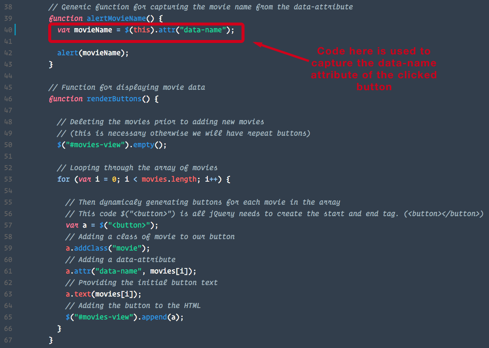

* Also point out how we used an alternative `.on("click")` event. Instead of using an `.on("click")` event associated with our buttons, we created one that was associated with the `document`. This was necessary to ensure that the dynamically created elements were bound to jQuery. 

  * Demonstrate how the app would function with both sets of event syntax.

    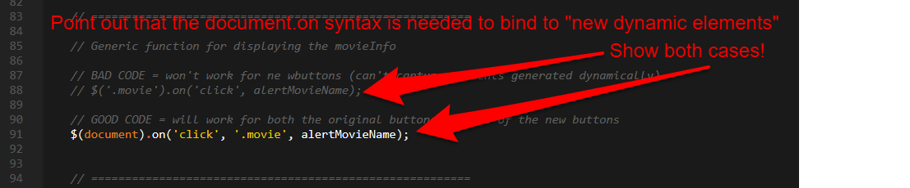

- - -

### 11. BREAK (15 min)

- - -

### 12. Students Do: Complete Working Movie App (25 min)

* Finally, open the working file: [`working-movie-app-solved.html`](Activities/06-WorkingMovieApp/working-movie-app-solved.html) in your browser and demonstrate what the final application will look like.

* Then slack out the following files and instructions.

* **Files:**

  * [`working-movie-app-easier.html`](Activities/06-WorkingMovieApp/working-movie-app-easier.html)
  * [`working-movie-app-harder.html`](Activities/06-WorkingMovieApp/working-movie-app-harder.html)

* **Instructions:**

  * Using either version of the starter code provided to you, complete the application so that various snippets of information about your movie are displayed underneath. As a suggestion, display at least each of the following:

    * Movie Poster

    * Rating

    * Release Date

    * Plot

### 13. Instructor Do: Review Activity (5 min)

* Review the final application's code as shown in [`working-movie-app-solved.html`](Activities/06-WorkingMovieApp/working-movie-app-solved.html).

* Point out how this application's code basically consists of an AJAX call which retrieves data from the OMDb API, parses it, then displays it inside of an HTML element.

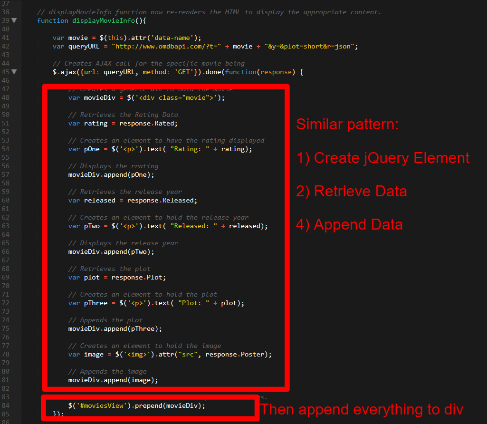

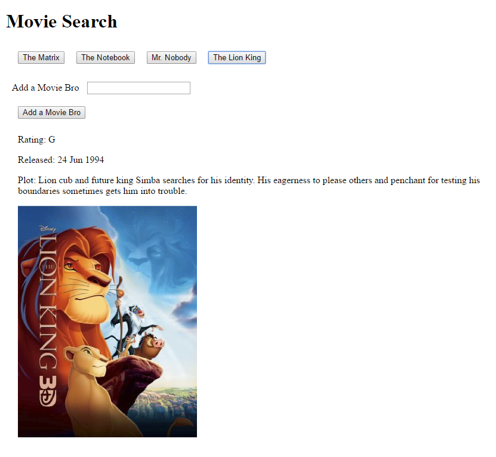

### 14. Students Do: Spotify App (20 min - OPTIONAL)

* If you have any extra time, then proceed with the Spotify application.

* Slack out the following file and instructions to students.

* **Files:**

  * [`spotify-app-starter.html`](Activities/07-SpotifyApp/spotify-app-starter.html)

* **Instructions:**

  * Using the starter code provided to you, complete the application such that your code will render a Spotify Music player listing out the top song of any artist selected in the text-box.

  * HINT: This is hard

  * HINT: You will need TWO AJAX calls.

### 15. Instructor Do: Review Spotify App (5 min - OPTIONAL)

* Review the Spotify code. Be sure to point out how TWO AJAX calls were needed as Spotify stores all of its track information by Artist ID and NOT Artist Name.

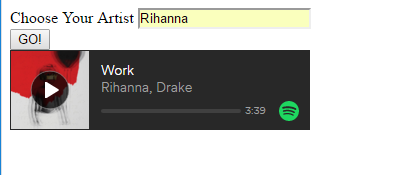

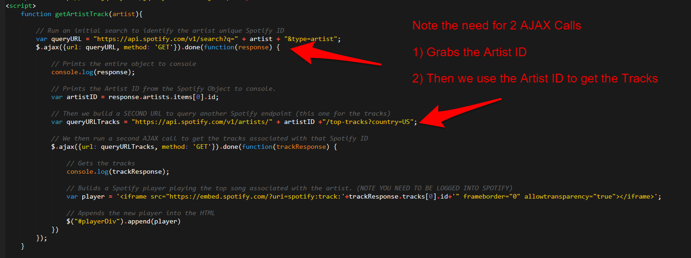

- - -

### Copyright

Coding Boot Camp (C) 2015. All Rights Reserved.
